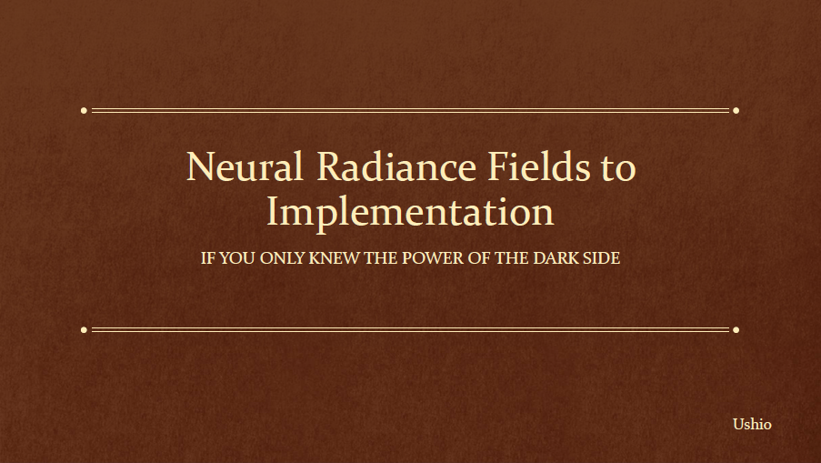

## NeRF implementation for RTCamp 8


https://sites.google.com/view/raytracingcamp8

The short introduction of the renderer is [here](slides/RedPill_Ushio.pdf)

## Environment
    Windows 10

    AMD: Navi 10 or later ( vega10 or vega20 could work but I didn't really test it )
    NVIDIA: compute capability 7.0 or later ( https://en.wikipedia.org/wiki/CUDA )

## Build

```
git submodule update --init
premake5 vs2019
```

open build\MachineLearning.sln

## Assets
This repository needs assets for training. Please find the link and put it as

https://www.dropbox.com/s/5gd2pgkkw1ukuzx/nerf.zip?dl=0

```
bin/nerf/photo4/*
bin/nerf/train/*
bin/nerf/val/*
bin/nerf/val/transforms_test.json
bin/nerf/val/transforms_train.json
bin/nerf/val/transforms_val.json
```

## Important Macros
| macro      | location| Description |
| ----------- |----------- | ----------- |
| INSTANT_NGP_SCENE | nerf.cpp | 0: rtcamp8 scene, 1: lego scene |
| SAMPLING_INTERRESTED_SEGMENT | bin\kernels\redpill_common.hpp | if INSTANT_NGP_SCENE==0 then this should be 1, otherwise 0 |
| ENABLE_WMMA | redpillg.hpp | 1 is recommended at NV device. AMD device cannot compile ENABLE_WMMA=1 yet |

## Important source codes
|  location| Description |
| ----------- | ----------- |
| bin\kernels\mlpForward.cu | main cuda kernel for machine learning |
| bin\kernels\redpill_common.hpp | helper kernel. mainly for sharing the logics on GPU/CPU |
| redpillg.hpp | main host code for machine learning |
| redpill.hpp | cpu reference for the debug purpose. Probably, NeRF class on this code won't work. |
| nerf.cpp | NeRF entry point |
| main.cpp | image reconstruction demo |

## Nerf parameter

The current parameters are for rtcamp8 at NeRFg constructor as follows:
```
m_learningRate = 2.0f;

m_hashConfig.L = 12;
m_hashConfig.T = std::pow( 2, 19 );
m_hashConfig.F = 2;
m_hashConfig.Nmin = 16;
m_hashConfig.b = 2.0f;
```

You can play around.

## Presentation Slides - Neural Radiance Fields to Implementation
You can find detailed explanation of NeRF at [here](slides/Presentation_NeRF_Ushio.pdf)

[](slides/Presentation_NeRF_Ushio.pdf)

## References
- Ben Mildenhall, Pratul P. Srinivasan, Matthew Tancik, Jonathan T. Barron, Ravi Ramamoorthi and Ren Ng, “NeRF: Representing Scenes as Neural Radiance Fields for View Synthesis”
- Thomas Müller, Fabrice Rousselle, Jan Novák, and Alex Keller, “Real-time Neural Radiance Caching for Path Tracing”
- Thomas Müller, Alex Evans, Christoph Schied, and Alexander Keller “Instant Neural Graphics Primitives with a Multiresolution Hash Encoding”
- “Instant NGP” repository : https://github.com/NVlabs/instant-ngp
- Takahiro Harada and Aaryaman Vasishta, “Introducing Orochi” https://gpuopen.com/learn/introducing-orochi/
- “Orochi” repository : https://github.com/GPUOpen-LibrariesAndSDKs/Orochi
- Jeremy Appleyard and Scott Yokim, “Programming Tensor Cores in CUDA 9” : https://developer.nvidia.com/blog/programming-tensor-cores-cuda-9/


